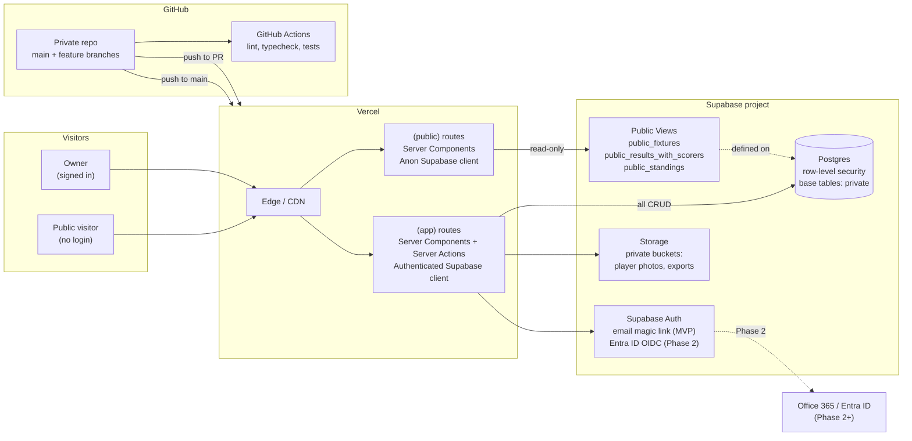

# 03 — Solution Architecture

## Recommended stack

| Layer | Choice | Notes |
|-------|--------|-------|
| Frontend framework | **Next.js 14+ (App Router)** | React Server Components, Server Actions, TypeScript |
| Hosting | **Vercel** | Native Next.js host, preview per PR, edge network |
| Source control | **GitHub** (private repo) | Branch protection on `main`, PR reviews |
| Database | **Supabase Postgres** | Managed Postgres, row-level security, realtime, auth |
| Authentication (MVP) | **Supabase Auth** (email magic link, single owner allow-listed) | Owner-only sign-in |
| Authentication (Phase 2) | **Microsoft Entra ID** via Supabase OIDC, plus per-user roles | Staff sign in with Office 365 |
| File storage | **Supabase Storage** | Player photos (private bucket), exports |
| UI library | **Tailwind CSS + shadcn/ui** | Fast, accessible, easy to theme |
| Charts | **Recharts** or **Tremor** | Lightweight, mobile-friendly |
| Forms | **React Hook Form + Zod** | Validation shared between client and server |
| Testing | **Vitest** (unit) + **Playwright** (E2E) | Vitest fast for logic, Playwright for flows |
| Observability | **Vercel Analytics + Supabase logs + Sentry** (free tier) | Errors and performance |
| Dev assistant | **Claude Code** | Per `08-github-and-claude-code-workflow.md` |

## Why this stack fits Kickstart Rush

**Vercel + Next.js.** Single-command deploys from GitHub, every PR gets a preview URL the owner can review on a phone, and the App Router cleanly separates the public site from the authenticated app via route groups. For a single-club app with one editor, splitting frontend and backend would be over-engineering.

**GitHub.** Already available. Source of truth for code, Vercel deploy trigger, issue tracker, and the project context that Claude Code reads. Branch protection prevents accidents on `main`.

**Supabase Postgres.** A real relational database without running infrastructure. Standings calculations work in SQL (not JavaScript), audit triggers are built in, row-level security enforces the public/private boundary at the database layer (not just in the app), and the same project provides auth and file storage.

**Email magic-link in MVP, Entra ID later.** With one user, magic-link is the simplest possible auth. When the club is ready to standardise on Office 365, Entra ID slots in via OIDC without a data migration — Supabase keeps the user record, the identity provider changes.

**Tailwind + shadcn/ui.** Avoids the generic-AI-app look by giving primitives, not finished components. Mobile-first by default — important because data entry on the touchline is the primary form factor.

## Public vs private — the core architectural split

Two route groups in the Next.js app:

```
src/app/
├── (public)/              # No auth required, narrow data, noindex
│   ├── layout.tsx         # Public layout (no nav into private app)
│   ├── public/fixtures/page.tsx
│   ├── public/results/page.tsx
│   └── public/standings/page.tsx
├── (app)/                 # Auth required, full data
│   ├── layout.tsx         # App shell, nav, owner-only
│   ├── dashboard/...
│   ├── fixtures/...
│   ├── standings/...
│   ├── players/...
│   ├── reviews/...
│   └── reports/...
└── (auth)/
    └── sign-in/page.tsx
```

Two principles enforce the split:

1. **Public pages query Postgres views** (`public_fixtures`, `public_results_with_scorers`, `public_standings`) that are explicitly defined to expose only the columns in the public surface. The base tables remain locked behind RLS.
2. **The Supabase anon key** used in `(public)` routes has no privileges on the base tables; only `SELECT` on the public views. Even if a bug surfaced the anon client in a private route, it could not read private data.

This pushes the public/private boundary into the database, which is the only place it can't be accidentally bypassed.

## Where Office 365 / Azure fits in

Office 365 / Azure is **available but not on the MVP critical path**. Planned uses:

- **Phase 2 — Entra ID for staff sign-in.** Adopted alongside multi-user roles, so a coach added to Entra automatically gains the right access.
- **Phase 3 — Calendar integration.** One-way push of fixtures and training sessions into staff Outlook calendars.
- **Phase 3 — Teams / SharePoint as a notification surface.** Scheduled card in a Teams channel listing the weekend's fixtures.
- **Optional — Azure Blob Storage** as a backup destination for nightly database dumps. Supabase backups are sufficient for MVP, but a second copy in the owner's tenant is cheap insurance.

The architecture is set up so none of these are required for the app to function. They are accelerants, not foundations.

## Microsoft Entra ID (planned for Phase 2)

When introduced, Entra ID will:

1. Become the sign-in method for staff.
2. Map Entra ID groups to Kickstart Rush roles (`Kickstart-Manager`, `Kickstart-Elite-Coach`, `Kickstart-Premier-Coach`, `Kickstart-Viewer`).
3. Enforce MFA at the identity provider — Kickstart Rush inherits it automatically.

Implementation path: configure Entra ID as an OIDC provider in Supabase Auth. Roles read from a `profiles.role` column populated from the Entra group claim on first sign-in. Magic-link may remain for the owner's break-glass account.

## High-level architecture



## Environments

Three environments, each backed by a separate Supabase project to keep production data clean.

| Environment | Trigger | URL | Database |
|-------------|---------|-----|----------|
| **Local** | Developer machine | `localhost:3000` | Local Supabase (Docker) or shared dev Supabase |
| **Preview** | Every pull request | `kickstart-rush-pr-<n>.vercel.app` | Dev Supabase project |
| **Production** | Push to `main` (after PR merge) | Custom domain (e.g. `app.kickstart.example`) or `kickstart-rush.vercel.app` | Production Supabase project |

Public pages are served at `/public/*` of each environment URL.

Environment variables are managed in:
- `.env.local` (local only, never committed)
- Vercel project settings (per-environment)
- Supabase project settings (per-environment)

See `12-deployment-and-operations.md` for the full variable list.

## Key architectural decisions and rationale

| Decision | Why |
|----------|-----|
| Single Next.js app with `(public)` and `(app)` route groups | One deployable unit; the split is enforced by data, not routing alone |
| Public pages read only from dedicated Postgres views | Boundary is in the database, where it cannot be bypassed |
| Anon Supabase client granted SELECT on public views only | Defence in depth — base tables stay private even if app code regresses |
| Server Actions over REST endpoints | Less plumbing, type-safe across client/server |
| Standings computed as a Postgres view | Source of truth is data, not code; cannot drift |
| Row-level security enabled from day one | Cheaper to add early than retrofit later |
| Audit table populated by Postgres triggers | Cannot be bypassed by a buggy client |
| `noindex` + `robots.txt` disallow on public pages | Indexing decision deferred; reachable by URL only |
| TypeScript strict mode | Catches errors before they reach a coach on matchday |
| No global state library | Server Components handle most state; useState is enough for the rest |

## What is intentionally not in the architecture

- **No microservices.**
- **No Kubernetes, Docker Compose for production, or self-hosted infra.** Managed services only.
- **No GraphQL.** Postgres queries via the Supabase client are simpler.
- **No Redis / caching tier.** Vercel's edge cache and Postgres are enough.
- **No event bus or queue.**
- **No public API.** The public surface is HTML pages, not a JSON API.

If any of these are needed later, they are additive, not rewrites.
