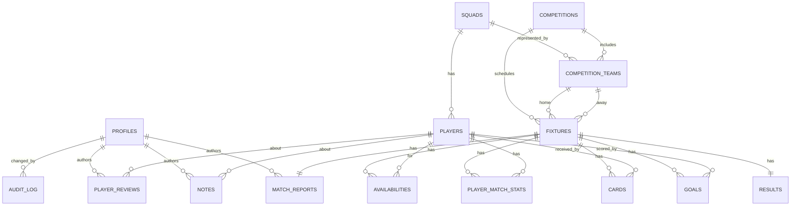

# 04 — Data Model

This is the relational model for Kickstart Rush, implemented as Supabase Postgres tables. Standings are a database view, not application code. The public surface is also a set of database views — defined explicitly so the public/private boundary can't be eroded by app changes.

## Core entities

| Entity | Purpose |
|--------|---------|
| `profiles` | Application user account (links to Supabase Auth user) — owner only in MVP |
| `squads` | A team the club operates (Elite, Premier) |
| `players` | A player belonging to a squad |
| `competitions` | A league or tournament (e.g. BFA U15 Zone A 2026) |
| `competition_teams` | The teams competing in a competition |
| `fixtures` | A scheduled match between two competition teams |
| `results` | The result of a played fixture |
| `goals` | A goal scored in a fixture |
| `cards` | A yellow or red card in a fixture |
| `match_reports` | The narrative attached to a fixture (private) |
| `player_match_stats` | Per-player minutes and contribution for a fixture |
| `availabilities` | A player's availability for a fixture |
| `player_reviews` | A monthly structured review of a player |
| `notes` | Free-form coach observations attached to a player |
| `audit_log` | Append-only record of edits to sensitive entities |

## Tables and key fields

### `profiles`
| Field | Type | Notes |
|-------|------|-------|
| `id` | uuid (PK, FK → `auth.users.id`) | Supabase Auth user id |
| `email` | text | |
| `display_name` | text | |
| `role` | enum | `owner` in MVP. `coach`, `viewer` reserved for Phase 2 |
| `assigned_squad_id` | uuid (nullable, FK → `squads.id`) | Phase 2 only |
| `created_at` | timestamptz | |

### `squads`
| Field | Type | Notes |
|-------|------|-------|
| `id` | uuid (PK) | |
| `code` | text | `ELITE`, `PREMIER` |
| `name` | text | "Kickstart Elite", "Kickstart Premier" |
| `age_group` | text | `U15` |
| `season` | text | `2026` |

### `players`
| Field | Type | Notes |
|-------|------|-------|
| `id` | uuid (PK) | |
| `squad_id` | uuid (FK → `squads.id`) | |
| `first_name`, `last_name` | text | |
| `display_name` | text (generated) | "F. Lastname" or full — used in public views |
| `date_of_birth` | date | Validated against age-group eligibility |
| `preferred_position` | enum | `GK`, `DEF`, `MID`, `FWD` |
| `jersey_number` | int (nullable) | Unique per squad per season |
| `status` | enum | `active`, `injured`, `unavailable`, `inactive` |
| `photo_url` | text (nullable) | Supabase Storage URL (private) |
| `notes_summary` | text (nullable) | |
| `created_at`, `updated_at` | timestamptz | |
| `deleted_at` | timestamptz (nullable) | Soft-delete marker |

A computed `display_name` is added so the public view can reference one stable, owner-controlled column rather than concatenating in SQL each time. The owner can decide per-season whether to render full names or initials in the public surface.

### `competitions`
| Field | Type | Notes |
|-------|------|-------|
| `id` | uuid (PK) | |
| `name` | text | "BFA U15 Zone A Qualifiers 2026" |
| `code` | text | `BFA-U15-ZA-2026` |
| `stage` | enum | `qualifier`, `super_8`, `plate`, `friendly`, `other` |
| `season` | text | `2026` |
| `points_for_win`, `points_for_draw` | int | Default 3 / 1 |
| `is_public` | boolean | Default true. Controls whether the competition appears in public views |

### `competition_teams`
| Field | Type | Notes |
|-------|------|-------|
| `id` | uuid (PK) | |
| `competition_id` | uuid (FK) | |
| `team_name` | text | "Empire Club", "Whitehall FA", etc. |
| `is_kickstart` | boolean | True for our squads |
| `squad_id` | uuid (nullable, FK → `squads.id`) | |

### `fixtures`
| Field | Type | Notes |
|-------|------|-------|
| `id` | uuid (PK) | |
| `competition_id` | uuid (FK) | |
| `home_team_id`, `away_team_id` | uuid (FK → `competition_teams.id`) | |
| `kickoff_at` | timestamptz | |
| `venue` | text | |
| `status` | enum | `scheduled`, `played`, `postponed`, `cancelled` |
| `notes` | text (nullable) | Owner-only |

### `results`
| Field | Type | Notes |
|-------|------|-------|
| `fixture_id` | uuid (PK, FK → `fixtures.id`) | |
| `home_score`, `away_score` | int | |
| `ht_home_score`, `ht_away_score` | int (nullable) | Owner-only |
| `recorded_by` | uuid (FK → `profiles.id`) | |
| `recorded_at` | timestamptz | |

### `goals`
| Field | Type | Notes |
|-------|------|-------|
| `id` | uuid (PK) | |
| `fixture_id` | uuid (FK) | |
| `team_id` | uuid (FK → `competition_teams.id`) | |
| `player_id` | uuid (nullable, FK → `players.id`) | Nullable for opponent goals |
| `scorer_label` | text (nullable) | Used in public view: player display_name when from our squad, opponent team name otherwise |
| `minute` | int | |
| `is_own_goal` | boolean | |
| `is_penalty` | boolean | |

### `cards`
| Field | Type | Notes |
|-------|------|-------|
| `id` | uuid (PK) | |
| `fixture_id` | uuid (FK) | |
| `player_id` | uuid (nullable, FK → `players.id`) | |
| `colour` | enum | `yellow`, `red`, `second_yellow` |
| `minute` | int | |

**Cards are private.** They name players on yellow / red, and even for the opposition they aren't useful publicly. Not surfaced in any public view.

### `match_reports`
| Field | Type | Notes |
|-------|------|-------|
| `id` | uuid (PK) | |
| `fixture_id` | uuid (FK, unique) | |
| `summary` | text | |
| `key_moments` | text | |
| `motm_player_id` | uuid (nullable, FK → `players.id`) | |
| `coach_notes` | text | |
| `status` | enum | `draft`, `published` |
| `author_id` | uuid (FK → `profiles.id`) | |
| `created_at`, `updated_at` | timestamptz | |

**All match reports are private in MVP**, regardless of `status`. The status enum is retained for Phase 2 / 3 when curated public reports may be introduced.

### `player_match_stats`
| Field | Type | Notes |
|-------|------|-------|
| `id` | uuid (PK) | |
| `fixture_id` | uuid (FK) | |
| `player_id` | uuid (FK) | |
| `started` | boolean | |
| `minutes_played` | int | |
| `goals` | int | |
| `assists` | int | |
| `yellow_cards`, `red_cards` | int | |

### `availabilities`
| Field | Type | Notes |
|-------|------|-------|
| `id` | uuid (PK) | |
| `fixture_id` | uuid (FK) | |
| `player_id` | uuid (FK) | |
| `status` | enum | `available`, `unavailable`, `injured`, `suspended`, `unknown` |
| `reason` | text (nullable) | |
| `set_by` | uuid (FK → `profiles.id`) | |
| `set_at` | timestamptz | |

### `player_reviews`
| Field | Type | Notes |
|-------|------|-------|
| `id` | uuid (PK) | |
| `player_id` | uuid (FK) | |
| `review_period` | text | `2026-05` (year-month) |
| `technical` | int (1–5) | |
| `tactical` | int (1–5) | |
| `physical` | int (1–5) | |
| `attitude` | int (1–5) | |
| `strengths` | text | |
| `to_improve` | text | |
| `next_focus` | text | |
| `author_id` | uuid (FK) | |
| `created_at` | timestamptz | Reviews immutable; corrections create new rows |

### `notes`
| Field | Type | Notes |
|-------|------|-------|
| `id` | uuid (PK) | |
| `player_id` | uuid (FK) | |
| `body` | text | |
| `author_id` | uuid (FK) | |
| `is_private` | boolean | Internal-only flag; whole table is private to the app anyway |
| `created_at` | timestamptz | |

### `audit_log`
| Field | Type | Notes |
|-------|------|-------|
| `id` | bigserial (PK) | |
| `table_name` | text | |
| `row_id` | uuid | |
| `action` | enum | `insert`, `update`, `delete` |
| `changed_by` | uuid (FK → `profiles.id`) | |
| `changed_at` | timestamptz | |
| `before_data` | jsonb | |
| `after_data` | jsonb | |

Implemented via a Postgres trigger on `results`, `goals`, `cards`, `player_reviews`, `players`, `match_reports`, `fixtures`. Cannot be bypassed by the application layer.

## Public views

These three views are the **only** thing the anon role can read. The anon role has `SELECT` on each view and no privileges anywhere else. Each view explicitly lists its columns — no `SELECT *`. Adding a column to a base table never automatically exposes it.

### `public_fixtures`

```sql
CREATE OR REPLACE VIEW public_fixtures AS
SELECT
  f.id,
  c.name              AS competition_name,
  c.code              AS competition_code,
  c.stage             AS competition_stage,
  ht.team_name        AS home_team,
  at.team_name        AS away_team,
  f.kickoff_at,
  f.venue,
  f.status
FROM fixtures f
JOIN competitions c       ON c.id = f.competition_id
JOIN competition_teams ht ON ht.id = f.home_team_id
JOIN competition_teams at ON at.id = f.away_team_id
WHERE c.is_public = true;
```

Exposes: competition name, both team names, kick-off, venue, status. Nothing else. Notably absent: `notes`.

### `public_results_with_scorers`

```sql
CREATE OR REPLACE VIEW public_results_with_scorers AS
SELECT
  f.id                AS fixture_id,
  c.name              AS competition_name,
  ht.team_name        AS home_team,
  at.team_name        AS away_team,
  f.kickoff_at,
  f.venue,
  r.home_score,
  r.away_score,
  -- Scorers as a JSON array, ordered by minute
  COALESCE(
    (
      SELECT jsonb_agg(
        jsonb_build_object(
          'team',     gt.team_name,
          'scorer',   g.scorer_label,
          'minute',   g.minute,
          'penalty',  g.is_penalty,
          'own_goal', g.is_own_goal
        ) ORDER BY g.minute
      )
      FROM goals g
      JOIN competition_teams gt ON gt.id = g.team_id
      WHERE g.fixture_id = f.id
    ),
    '[]'::jsonb
  ) AS scorers
FROM fixtures f
JOIN results r            ON r.fixture_id = f.id
JOIN competitions c       ON c.id = f.competition_id
JOIN competition_teams ht ON ht.id = f.home_team_id
JOIN competition_teams at ON at.id = f.away_team_id
WHERE c.is_public = true
  AND f.status = 'played';
```

Exposes: scores, scorers (player display_name when from our squad, opposing team name when not), goal minute, penalty/own-goal flags. Notably absent: cards, half-time score, match report, MOTM, recording metadata.

### `public_standings`

```sql
CREATE OR REPLACE VIEW public_standings AS
SELECT
  cs.competition_id,
  c.name AS competition_name,
  c.code AS competition_code,
  cs.team_id,
  cs.team_name,
  cs.position,
  cs.played,
  cs.won,
  cs.drawn,
  cs.lost,
  cs.goals_for,
  cs.goals_against,
  cs.goal_difference,
  cs.points,
  cs.form_last_five
FROM competition_standings cs
JOIN competitions c ON c.id = cs.competition_id
WHERE c.is_public = true;
```

Exposes: the same standings table the owner sees. No private data is involved in the underlying calculation.

### What a malicious or curious anon visitor cannot see

- Player records, DOB, photos, jersey numbers, status.
- Cards.
- Match reports (any state).
- Reviews, notes, availabilities.
- Audit log.
- The owner's email or session.
- Any of the underlying base tables — `SELECT` is denied at the database, not just the app.

## Standings calculation logic

Standings are a Postgres **view** named `competition_standings`. Recomputed on every read.

Per team in a competition:
1. **Played** = count of fixtures where the team is home or away and `status = 'played'`.
2. **Won / Drawn / Lost** from comparing scores.
3. **Goals For / Goals Against** summed from the team's perspective.
4. **Goal Difference** = GF − GA.
5. **Points** = `won * competitions.points_for_win + drawn * competitions.points_for_draw`.
6. **Form** = last five played fixtures, ordered by `kickoff_at DESC`, expressed as W/D/L codes.

Tie-breakers, in order:
1. Points (desc)
2. Goal Difference (desc)
3. Goals For (desc)
4. Head-to-head points between tied teams
5. Alphabetical (deterministic last-resort)

The view exposes one row per `competition_team`. The frontend (private and public) renders the table directly.

## Player progression tracking

A player's progression is the trend across:

- **`player_reviews`** — monthly 1–5 ratings on four dimensions, plus narrative.
- **`player_match_stats`** — minutes, goals, assists, cards over time.
- **`notes`** — qualitative observations.

The player profile renders:
- A line chart of the four review dimensions over `review_period`.
- Cumulative minutes and contributions per fixture.
- A reverse-chronological feed of notes.

Reviews are append-only. A "correction" creates a new review for the same `review_period` and the most recent one wins for chart purposes; older versions remain visible in a "Review history" drawer.

All of this remains private in MVP.

## ER diagram



## Seed data for both squads

The MVP seeds two competitions with the actual BFA U15 fixtures.

**Zone A — BFA U15 Zone A Qualifiers 2026** (`is_public = true`) — eight competition teams: Empire Club, FM Four Pillars, Kickstart Elite, National Sports Council, Potential Ballers, Pro Shottas Utd, St. Philip Academy, Technique FC.

**Zone B — BFA U15 Zone B Qualifiers 2026** (`is_public = true`) — eight competition teams: First Touch FC, Kickstart Premier, Mavericks SC, Notre Dame SC, Pinelands, Pro Shottas Spurs, United Stars Alliance, Whitehall FA.

All 28 group-stage fixtures per zone are seeded.

## Indexes (for performance)

- `fixtures (competition_id, kickoff_at)` — list pages.
- `goals (fixture_id, minute)` — public results view.
- `player_match_stats (player_id)` — player profile.
- `player_reviews (player_id, review_period DESC)` — review trend.
- `availabilities (fixture_id)` — matchday squad screen.
- `audit_log (table_name, row_id, changed_at DESC)` — history view.

## Validation rules at the database

- `players.date_of_birth` must satisfy U15 eligibility (`>= 2011-01-01 AND <= 2013-12-31`) — check constraint with override flag.
- `results.home_score >= 0` and `results.away_score >= 0`.
- `player_reviews.{technical,tactical,physical,attitude}` between 1 and 5.
- `availabilities` unique on (`fixture_id`, `player_id`).
- `goals.scorer_label` non-null when `goals` is inserted (database-level convenience for the public view; a trigger populates it from `players.display_name` when `player_id` is set, or from the opposition `competition_teams.team_name` when not).

## Database privilege model

Two database roles relevant in MVP:

| Role | Capability |
|------|-----------|
| `authenticated` (owner's session) | Full RLS-bound access to all tables. RLS policies grant ALL on each table where `auth.uid() = profiles.id AND profiles.role = 'owner'`. |
| `anon` (public visitor) | `SELECT` on the three public views only. No privileges on any base table. |

This is the line of defence that makes the public/private split structural rather than incidental.
