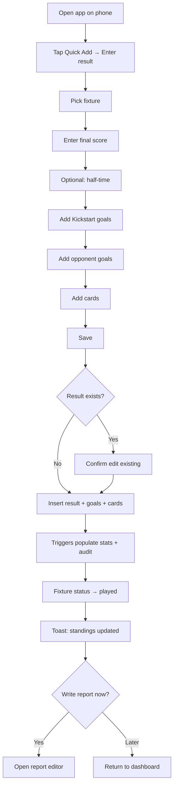
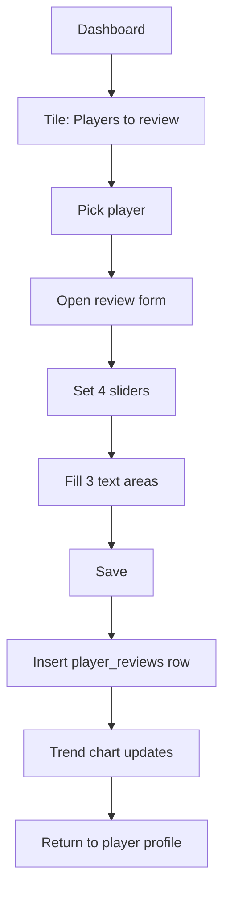
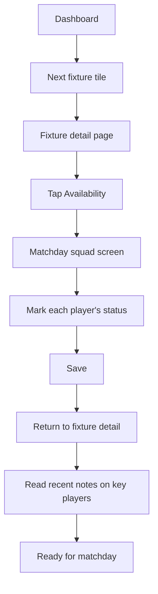

# 07 — User Flows

Five core flows. Each is described step by step and, where the path branches meaningfully, includes a Mermaid diagram. The flows are written in the language of the role doing the work.

## Flow 1 — Entering a match result

**Trigger:** A fixture has been played; a coach is at the venue or just home.

**Actor:** Coach (or Manager).

**Pre-conditions:** The fixture exists in the system with status `scheduled`. The coach is signed in.

### Steps
1. Open the app on phone. Dashboard loads.
2. Tap the "Last fixture" or use Quick Add → "Enter result".
3. Confirm fixture details (opponent, venue, kick-off). Tap "Enter result".
4. Enter final score (home, away).
5. Optionally enter half-time score.
6. Add scorers: pick player from squad, add minute, mark penalty / own goal if applicable. Repeat for each goal scored by Kickstart.
7. Add opponent goals (no player picker; only minute and own-goal flag).
8. Add cards: yellow / red / second yellow, player (or "opponent"), minute.
9. Tap "Save".
10. App writes to `results`, `goals`, `cards`. Triggers populate `player_match_stats` and `audit_log`.
11. Fixture status becomes `played`. Standings view recomputes on next read.
12. Confirmation toast: "Result saved. Standings updated."
13. Coach is offered "Write match report now" or "Later".

### Branches
- If the same coach attempts to save a duplicate result, the system asks: "A result already exists. Edit it?" → goes to edit mode.
- If a player picker has no players (squad empty), warn and offer "Add player first".

## Flow 2 — Updating the standings

**Trigger:** A result is saved.

**Actor:** System (no human action).

**Pre-conditions:** A row exists in `results` for the fixture.

### Steps
1. The save in Flow 1 commits a row to `results`.
2. The `competition_standings` Postgres view is **not** materialised; it is a regular view.
3. The next time any user opens the standings page (or the dashboard tile), the view query runs:
   - For each `competition_team` in the competition, aggregate played fixtures.
   - Compute P, W, D, L, GF, GA, GD, Pts.
   - Compute form by selecting the last five played fixtures by `kickoff_at DESC`.
   - Apply tie-breakers: Pts → GD → GF → head-to-head → alphabetical.
4. The page renders the table.
5. There is **no** background job, no manual recalculation, no cache to invalidate.

### Why this design
- Reading the standings is infrequent enough that view-on-read is cheap.
- Eliminates an entire class of "the standings are wrong" bugs by removing the gap between the data and the table.
- Makes the standings algorithm version-controlled (in a SQL migration), not hidden in application code.

### When would this not be enough?
- If the standings page becomes one of the most-hit endpoints in the app and the eight-team view is replaced by a season-long, multi-competition view, materialised views or a small denormalised cache would be considered. Not in MVP.

## Flow 3 — Completing a player review

**Trigger:** It is the start of a new month, or a coach proactively wants to record a review.

**Actor:** Coach (or Manager).

**Pre-conditions:** The player is `active`. The coach is signed in.

### Steps
1. From dashboard, tap "Players to review this month" tile, OR navigate to the player profile.
2. Tap "New review" on the player.
3. Form opens:
   - Sliders for Technical, Tactical, Physical, Attitude (1–5).
   - Strengths (text).
   - Areas to work on (text).
   - Next-month focus (text).
4. Tap "Save review".
5. App writes to `player_reviews`. Review is **immutable**.
6. Player profile → Reviews tab updates: trend chart re-renders to include the new period.
7. The "Players to review this month" tile decrements.

### Correcting a review
- On the player profile, find the review → "Correct".
- A new review form opens prefilled with the existing values. Author must add a "Reason for correction".
- On save, a new `player_reviews` row is inserted for the same `review_period`. The chart uses the most recent. The original row remains; the history drawer shows both with reasons.

## Flow 4 — Viewing a player's progression over time

**Trigger:** Manager or coach wants to see how a player has developed.

**Actor:** Manager, Coach, or Viewer.

**Pre-conditions:** The player has at least one review or one match recorded.

### Steps
1. From the squad list (`/squads/ELITE/players`), tap a player.
2. Player profile loads on the Overview tab.
3. Tap the **Reviews** tab.
4. The trend chart renders: x-axis is `review_period` (e.g. 2026-05, 2026-06), four lines for the four dimensions.
5. Below the chart, reviews are listed reverse-chronologically with strengths, areas to improve, and next focus.
6. Tap the **Matches** tab.
7. A table renders one row per fixture: date, opponent, result, started/sub, minutes, goals, cards.
8. Cumulative totals appear in the header (e.g. "5 matches, 312 minutes, 2 goals").
9. Tap the **Notes** tab.
10. Notes feed renders newest-first. Manager sees private notes; coaches see only their own private notes; viewers see only public.

### Outcome
The user can answer "is this player progressing?" with the chart, "is this player getting time?" with the matches tab, and "what are we noticing?" with the notes tab — without leaving the profile.

## Flow 5 — Reviewing upcoming fixtures

**Trigger:** Anyone wants to know what's next.

**Actor:** Manager, Coach, or Viewer.

### Steps
1. Open dashboard.
2. The "Next fixture" tile shows the soonest upcoming for each squad: opponent, date, kick-off, venue.
3. Tap the tile to open the fixture list, filtered to upcoming.
4. The list shows the next 10 fixtures across both squads (or filtered to one).
5. Tap any fixture for full detail: opponent, venue, kick-off, competition stage, current availability count, link to set availability, link to head-to-head record (Phase 2).

### Coach pre-match check (combined flow)
1. Open the next fixture.
2. Tap **Availability** → matchday squad screen.
3. Mark each player's status (Available / Unavailable / Injured / Suspended / Unknown).
4. Add reasons for non-availability where useful.
5. Save. Counts update on the dashboard tile.
6. Optionally tap **Notes** on key players to revisit recent observations before the match.

