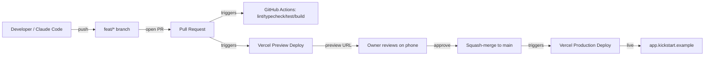

# 12 — Deployment and Operations

A small app needs a reliable, boring deployment story. With a public surface in play, the operational checks now include a privacy/indexing posture verification step.

## GitHub to Vercel deployment model



Every push to a feature branch produces a preview URL covering both the private app and the public site at `/public/*`. Every merge to `main` deploys to production.

## Environment variables

Documented in `.env.example`. Required values:

| Variable | Purpose | Where set |
|----------|---------|-----------|
| `NEXT_PUBLIC_SUPABASE_URL` | Supabase project URL (client-safe) | Vercel + local |
| `NEXT_PUBLIC_SUPABASE_ANON_KEY` | Supabase anon key (client-safe) — privileges: SELECT on public views only | Vercel + local |
| `SUPABASE_SERVICE_ROLE_KEY` | Server-only privileged key — never imported in `(public)` routes | Vercel (server) + local |
| `NEXT_PUBLIC_APP_URL` | Public URL for the environment | Vercel + local |
| `OWNER_ALLOWED_EMAIL` | The single owner email allow-listed for sign-in | Vercel + local |
| `SENTRY_DSN` | Sentry project DSN | Vercel (Phase 2 onward) |
| `RESEND_API_KEY` (optional) | Transactional email if Supabase email isn't used | Vercel |

Each environment in Vercel — Development, Preview, Production — has its own values. All environments connect to the same single Supabase project.

## One Supabase project

Local development, Vercel previews, and production all use the same Supabase project (`mxgsiegzllsbkqrhujrk`). There is no separate dev or staging database.

**Trade-off accepted:** for a single-user app with no concurrent developers, the theoretical sandbox safety of a separate dev project is outweighed by the operational complexity it creates (two sets of credentials, two migration targets, two seeds). Supabase automated daily backups are the primary mitigation for accidental data loss. A manual snapshot is taken before any non-additive migration.

## Preview deployments

- Every PR gets a `https://kickstart-rush-pr-<n>.vercel.app` URL.
- Preview deploys connect to the same Supabase project as production (single environment).
- Preview URLs are linked from the PR by a comment workflow.
- Auth on previews uses the same magic link and the same owner account.
- Public pages on preview are also `noindex` (production posture is identical, so the preview reflects reality).

## Production release approach

1. PR is opened, reviewed, CI passes.
2. Owner reviews preview URL on a phone — both the private dashboard and a public page if either was touched.
3. PR is squash-merged to `main`.
4. Vercel auto-deploys `main` to production.
5. Vercel emits a deploy notification.
6. **Smoke check (private):** open the app, sign in, check the dashboard tile values.
7. **Smoke check (public):** open `/public/standings` in an incognito window; verify no sign-in is required and no private fields render; verify `noindex` meta and `X-Robots-Tag` header.
8. If something is wrong, **redeploy the previous deployment** from Vercel (one-click rollback).

### Database migrations
Migrations are applied separately from code deploys.

1. The migration is committed in the PR alongside the code that needs it.
2. The migration SQL is reviewed in the PR diff before merge.
3. After PR merge to `main`, the migration is applied via the Supabase CLI:
   ```bash
   npx supabase link --project-ref mxgsiegzllsbkqrhujrk
   npx supabase db push
   ```
4. Then the Vercel deploy is allowed to roll out.
5. A snapshot is taken before any non-additive migration.

### Public-view migrations — special care
Any migration that touches `public_fixtures`, `public_results_with_scorers`, or `public_standings`:

- Must be reviewed in PR with the diff of the view definition explicitly read.
- Must be verified against an automated test that lists the columns the view exposes and compares to an allow-list.
- Must not be combined with unrelated changes.

This is the most sensitive surface in the system; it is treated accordingly.

## Indexing and `robots.txt`

The current posture is: **public pages are reachable but not indexable.** The decision to allow indexing is deferred to Phase 2.

Implementation:

- `<meta name="robots" content="noindex,nofollow">` rendered in the `(public)` layout.
- HTTP header `X-Robots-Tag: noindex, nofollow` set on every response from `(public)/*` routes (configured in `next.config.mjs` headers).
- `public/robots.txt` contents:

  ```
  User-agent: *
  Disallow: /public/
  Disallow: /
  ```

  (Disallow `/` as well to discourage crawling of any auth-gated path that might 302.)

- A pre-merge check (Playwright test) opens a public page on the preview URL and asserts the meta and the response header.
- The decision to flip indexing on is recorded in `docs/runbook.md` and requires a deliberate change to all three of the above.

## Monitoring and support

### What is monitored
- **Errors:** Sentry captures unhandled exceptions in client and server. Email alert on new error type.
- **Performance:** Vercel Analytics (private only) shows web vitals per route. Public pages are excluded from any user-tracking analytics.
- **Database:** Supabase dashboard shows query performance and error rate.
- **Auth:** Supabase Auth dashboard shows sign-in attempts.
- **Uptime:** Vercel's uptime dashboard.

### Who watches it
- The owner checks Sentry once per week and after any qualifier weekend.
- An email digest from Vercel summarises the previous week's traffic.
- Critical errors trigger an immediate email.

### Support model
- The owner is the operator and first responder.
- A `docs/runbook.md` (added during Epic H) lists common tasks: re-run a backup, restore a record from audit log, switch `display_name` format club-wide, flip a competition's `is_public` flag, change indexing posture.

## Backup and export recommendations

### Daily backups
- Supabase **point-in-time recovery** when on a paid plan (recommended once active).
- Supabase **daily snapshots** on free tier.
- Verify weekly that the latest backup exists.

### Weekly secondary backup
- Every Sunday: a `pg_dump` of production is run by the owner (or a scheduled action) and uploaded to a folder in the owner's OneDrive (Office 365). Encrypted.
- Retention: 8 weekly backups (~2 months).

### Pre-migration backup
- Before any non-additive migration in production, a manual snapshot is taken via the Supabase dashboard.
- The migration is only applied after the snapshot succeeds.

### Restoration drill
- Once before MVP go-live and at least once per season thereafter, a backup is restored to a fresh Supabase project. Result documented in `docs/runbook.md`.

### CSV exports
- Available from the UI to the owner for: fixtures, results, players, current standings.
- Not part of the public surface.

## Domain and DNS (when ready)

- A custom domain (e.g. `app.kickstart.example`) is added in Vercel project settings.
- DNS records (A or CNAME) are configured at the registrar.
- Vercel issues an SSL certificate automatically.
- Until a custom domain is set up, the production URL is the default `*.vercel.app`.

If a separate public-facing domain is preferred (e.g. `kickstart.example`), it can be added as a second domain pointing to the same Vercel project; the `(public)/*` routes are reachable from any domain pointed at the project.

## Cost monitoring

The project is designed to fit within free tiers during MVP. Indicators that an upgrade is needed:

- Supabase database approaching size limit.
- Supabase auth monthly active users approaching free tier limit (irrelevant in MVP — one user).
- Vercel build minutes consistently exceeding the free tier.
- Sentry monthly events exceeding the free tier.

A monthly review of usage is part of the owner's operational cadence.
